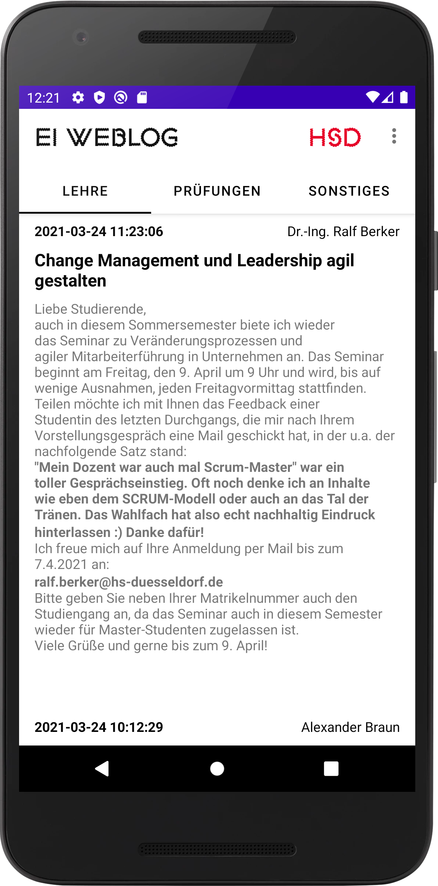

# HSD EI Weblog Android
This app is designed to load and display the information from the HSD EI Weblog on Android and also deliver push notifications on new updates to the Weblog.

This app is free and open-source. If you find it useful, consider buying me a beer for my work.

[Buy me a beer on PayPal](https://paypal.me/naresh97)

## Download
I will not be distributing this app on the PlayStore (or on FreeDroid at this moment) as the app does contain external resources which may or may not have more restrictive licensing.

The latest APK can always be downloaded from GitHub under Releases.

[**Download APK v0.10.1**](https://github.com/naresh97/ei-weblog-android/releases)

## Retrieving the weblog contents
The weblog is in essence a Microsoft Sharepoint page and therefore accessible by the [Sharepoint URL protocol](https://docs.microsoft.com/en-us/previous-versions/office/developer/sharepoint-2010/ms478653(v=office.14)).

## Retrieving exam results from OSSC
Since HIS eG, the distributor of the QIS and LSF software, has not made an API public. The page must be programmatically crawled, and the HTML parsed in order to retrieve the exam result information. Unfortunately, this is inherently unstable and must be periodically updated as the OSSC platform is changed.

## External resources
The fonts HSDSans-Regular and HSDSans-Elektro are used an included in this project.

## License
This project is licensed under the terms of the GPLv3 license. 
